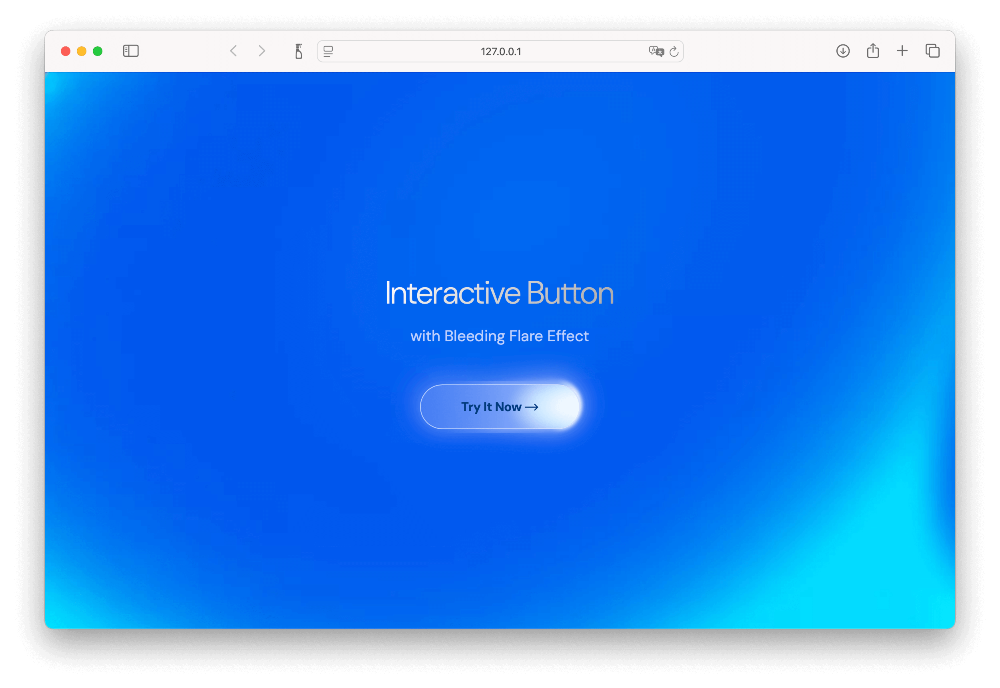

# Interactive Button with Bleeding Flare Effect

> 🎨 **Live Demo**: [View on CodePen](https://codepen.io/MastroPino/pen/yyNdPVz)

<!--
To add a preview image:
1. Take a screenshot of the button from preview.html
2. Upload it to your repository or image hosting service
3. Replace the placeholder URL below with your image URL
-->



A modern, interactive button component featuring a dynamic flare effect that follows the mouse cursor. This project demonstrates advanced CSS animations, JavaScript interactivity, and modern web design patterns.

## ✨ Features

-   **🌟 Dynamic Flare Effect**: A luminous flare element that smoothly follows the mouse cursor
-   **🎯 Smooth Interactions**: Fluid animations with cubic-bezier easing for natural feel
-   **💫 Modern Design**: Contemporary gradients, shadows, and backdrop filters
-   **📱 Responsive**: Optimized for all screen sizes and devices
-   **⚡ Performance**: Efficient CSS transforms and GPU-accelerated animations

## 🚀 Project Structure

```
interactive-button-flare/
├── index.html          # Main HTML structure and demo page
├── styles.css          # Complete styling with flare effects
├── script.js           # Mouse interaction and flare positioning logic
├── bg.webp             # Background texture
└── README.md           # Documentation
```

## 🔧 How It Works

### HTML Structure

The button is built with a semantic approach:

-   **Container**: `.btn-flare__wrapper` - Main button wrapper
-   **Button Element**: `.btn-flare` - The interactive button
-   **Text Content**: `.btn-flare__text` - Button label
-   **Flare Element**: `.btn-flare__flare` - The dynamic light effect

### CSS Magic

-   **Backdrop Filters**: Creates the glassmorphism effect
-   **CSS Gradients**: Smooth color transitions and lighting effects
-   **Transform Properties**: Hardware-accelerated positioning
-   **Transition Timing**: Custom cubic-bezier curves for natural motion

### JavaScript Logic

-   **Mouse Tracking**: Real-time cursor position detection
-   **Relative Positioning**: Calculates position within button bounds
-   **Smooth Animation**: Interpolated movement for the flare element
-   **Event Handling**: Optimized mousemove, mouseenter, and mouseleave events

## 🎯 Getting Started

### Prerequisites

-   Modern web browser (Chrome 60+, Firefox 55+, Safari 12+, Edge 79+)
-   VS Code with Live Server extension (recommended)

### Quick Start

1. **Clone or download** the project files
2. **Open in VS Code** and right-click on `index.html`
3. **Select "Open with Live Server"** to launch the demo
4. **Interact with the button** - move your mouse over it to see the flare effect!

### Local Development

```bash
# Navigate to project directory
cd interactive-button-flare

# Start a local server (Python 3)
python3 -m http.server 3000

# Or use Node.js
npx http-server -p 3000

# Open http://localhost:3000 in your browser
```

## 🎨 Customization

The button is highly customizable through CSS variables and classes:

### Color Scheme

```css
.btn-flare {
    --primary-color: #003b7d;
    --border-color: rgba(255, 255, 255, 0.6);
    --flare-color: rgba(255, 255, 255, 0.8);
}
```

### Size Variants

```css
.btn-flare--small {
    min-width: 150px;
    height: 40px;
}
.btn-flare--large {
    min-width: 250px;
    height: 64px;
}
```

## 🛠️ Technical Details

### Performance Optimizations

-   **GPU Acceleration**: Uses `transform3d` for smooth animations
-   **Debounced Events**: Optimized mouse tracking to prevent excessive redraws
-   **CSS Containment**: Isolates repaints to the button area

### Browser Compatibility

-   ✅ Chrome 60+
-   ✅ Firefox 55+
-   ✅ Safari 12+
-   ✅ Edge 79+
-   ⚠️ IE11 (partial support, no backdrop-filter)

## 🎉 Demo

**[🔗 Live Demo on CodePen](https://codepen.io/MastroPino/pen/yyNdPVz)**

## 💡 Use Cases

This button component is perfect for:

-   **Landing pages** and marketing sites
-   **Call-to-action** buttons
-   **Interactive portfolios**
-   **Modern web applications**
-   **UI component libraries**

## 🚀 About This Project

This project is part of my **frontend development portfolio**, showcasing:

-   **Advanced CSS techniques** - Gradients, backdrop filters, and smooth animations
-   **JavaScript interactivity** - Real-time mouse tracking and DOM manipulation
-   **Modern web standards** - Semantic HTML, responsive design, and accessibility
-   **Performance optimization** - GPU acceleration and efficient event handling
-   **Creative problem-solving** - Innovative visual effects and user interactions

_Perfect for demonstrating modern frontend skills to potential employers and clients._

## 📝 License

This project is open source and available under the [MIT License](LICENSE).

---

💫 _Created with passion for modern web interactions_ | 🌟 _Feel free to star if you found this useful!_
